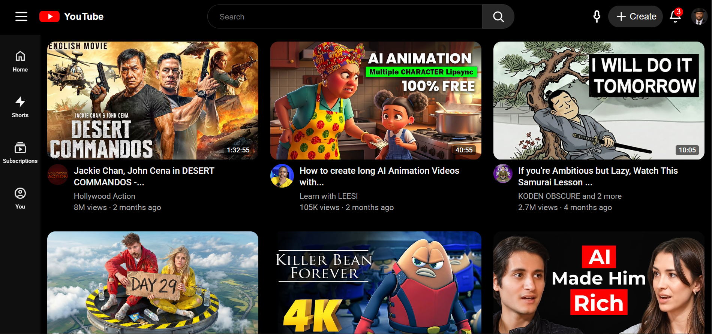

# YouTube Clone

A static YouTube interface built to practice modern frontend development concepts such as dynamic rendering, layout systems, and data-driven UI generation.

The project recreates the core layout of YouTube's homepage and dynamically renders video cards using JavaScript.

---

## Features

- Dynamic video card rendering using JavaScript
- Grid-based responsive layout
- Data-driven UI generation from a JavaScript data source
- Modular project structure
- Clean and scalable CSS architecture

---

## Tech Stack

**Languages**

- HTML5
- CSS3
- JavaScript (ES6+)

**Concepts Practiced**

- DOM manipulation
- Dynamic UI rendering
- Component-like UI structure
- Responsive layout systems
- Data-driven interfaces

---

## What I Learned

- Structuring frontend projects for scalability
- Rendering UI elements dynamically with JavaScript
- Building reusable layout patterns
- Organizing CSS into modular architecture

---

## Future Improvements

- Add video filtering and search functionality
- Implement sidebar navigation interaction
- Improve responsive behavior across devices
- Integrate a real API for video data

---

## Preview

---

## Live Demo

🔗 https://Timothykorea.github.io/youtube-clone/
